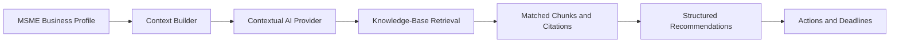

# 🚀 MSME AI

**AI-powered compliance, government-scheme, opportunity, and document intelligence platform for MSMEs.**

[](https://react.dev/)
[](https://www.typescriptlang.org/)
[](https://nodejs.org/)
[](https://www.mongodb.com/)
[](server/src/services/ragRetrievalService.ts)

## 📌 Overview

MSME AI is a workspace for business owners who need to keep track of compliance obligations, government schemes, tenders, certifications, documents, deadlines, and follow-up work.

Users maintain a business profile once. The platform then presents business context alongside seeded records and a contextual assistant that returns structured recommendations. Its knowledge-retrieval layer searches an ingested collection of government-focused documents and returns source metadata and matched text with assistant responses.

The project is intended for MSME owners and teams that want a single place to review relevant information and turn it into actions. It is an assistance and review tool, not a government website, a certificate-verification portal, or a legal certification system.

## 🎯 Problem

MSMEs often have to manage registrations, licences, tax and other compliance requirements, schemes and subsidies, tenders, certifications, renewal dates, and supporting business documents. The relevant information is spread across different portals, notices, and files, making it difficult to identify what matters now and what needs attention next.

## 💡 Solution

```text
Business information
	↓
MSME business profile
	↓
Contextual AI analysis + knowledge retrieval
	↓
Relevant compliance, schemes, tenders, and certifications
	↓
Recommended actions
	↓
Deadlines and progress tracking
```

The assistant uses the stored business profile and application records to produce structured, profile-aware recommendations. The UI brings those recommendations together with operational pages for review and follow-up.

## ✨ Key Features

| Area                          | What is implemented                                                                                                                                                                                    |
| ----------------------------- | ------------------------------------------------------------------------------------------------------------------------------------------------------------------------------------------------------ |
| 🤖 AI Assistant               | Returns profile-aware recommendations, relevance indicators, eligibility factors, suggested actions, deadlines, and source metadata for scheme, compliance, priority, and general queries.             |
| 📋 Compliance Intelligence    | Lists compliance records with categories, authorities, periodicity, status, due dates, descriptions, and potential penalties.                                                                          |
| 💰 Schemes & Subsidies        | Displays scheme records with ministry, funding, eligibility criteria, benefits, match scores, deadlines, and official URLs.                                                                            |
| 🏛️ Tender Opportunities       | Displays tender notice numbers, issuing organisations, categories, estimated values, locations, submission deadlines, match scores, and status.                                                        |
| 🏆 Certification Intelligence | Tracks certification name, issuing body, category, certificate number, validity dates, and renewal status.                                                                                             |
| 📄 AI Document Intelligence   | Accepts PDF and image uploads, extracts PDF text or English OCR text, detects document types, registration identifiers, company names, dates, and expiry dates, then stores a review report.           |
| 🔎 Document Review            | Compares detected company name, GSTIN, and PAN values with the business profile and reports matches, mismatches, missing information, potential issues, confidence scores, and review recommendations. |
| 📚 RAG Knowledge Retrieval    | Ingests JSON knowledge-base documents into MongoDB and retrieves up to three matching chunks using token and keyword relevance scoring, with citations and official source metadata.                   |
| ⏰ Deadline Tracking          | Lists deadlines ordered by remaining time. Document expiry analysis can create or update a document-renewal deadline.                                                                                  |
| ✅ Action Center              | Stores follow-up items and lets users update action status. Document expiry analysis can create or update a pending document-fix action.                                                               |
| 📊 Executive Dashboard        | Brings business health, priority recommendations, deadlines, documents, and other workspace data into one view.                                                                                        |

> ⚠️ **Important:** Document Intelligence supports extraction and review. It does not authenticate documents or certify the legal validity of Udyam, GST, PAN, or other certificates. Extracted dates and fields should be checked against the original document and issuing authority.

## 🧠 How the AI Works



The current assistant is implemented as a contextual provider with query-specific recommendation paths. Before returning a response, it searches the MongoDB knowledge base for relevant chunks. The current retrieval implementation uses token and keyword matching; it is not an external LLM or a vector database integration.

Document analysis follows a separate workflow:

```text
Upload PDF/image → Extract text or OCR → Detect fields and dates
→ Compare with business profile → Retrieve renewal guidance
→ Save review → Create renewal deadline/action when an expiry date is found
```

## 🏗️ Architecture

```text
React + Vite frontend
	│  /api proxy
	▼
Express + TypeScript backend
	│
	├── REST controllers and routes
	├── Contextual assistant and RAG services
	├── PDF parsing and Tesseract.js OCR
	└── Mongoose models
		│
		▼
	     MongoDB
```

### Technology Stack

- **Frontend:** React 18, TypeScript, Vite, React Router, Tailwind CSS, Lucide React
- **Backend:** Node.js, Express, TypeScript, JWT authentication middleware, Multer uploads
- **Data:** MongoDB with Mongoose
- **Document processing:** `pdf-parse` for PDFs and `tesseract.js` with the bundled English trained data for images
- **AI support:** Contextual recommendation provider and MongoDB-backed government knowledge retrieval

## 📁 Project Structure

```text
src/
├── components/       Reusable UI components
├── pages/            Application pages
├── services/         Frontend API client and mock fallback data
├── types/            Shared frontend TypeScript types
└── App.tsx           Routes and application shell

server/src/
├── config/           Database configuration
├── controllers/      Request handlers
├── data/             JSON knowledge-base documents
├── middleware/       Authentication and error handling
├── models/           Mongoose models
├── routes/           Express routes
├── services/         Seeding, AI context, RAG, and document services
└── index.ts          Backend entry point
```

## ⚙️ Requirements

- Node.js 18 or newer
- npm
- MongoDB running locally or a reachable MongoDB instance

## 🚀 Getting Started

Install dependencies:

```bash
npm install
cd server
npm install
cd ..
```

Create `server/.env` when custom configuration is needed:

```env
PORT=5000
MONGO_URI=mongodb://127.0.0.1:27017/msme_ai_db
JWT_SECRET=replace_with_a_long_random_secret
```

The backend has local-development defaults, so `.env` is optional when using the default MongoDB connection.

Start the backend in one terminal:

```bash
cd server
npm run server
```

Start the frontend in a second terminal:

```bash
npm run dev
```

The backend listens on `http://localhost:5000`. Vite serves the frontend on `http://localhost:3000` and proxies `/api` requests to the backend.

For backend development with automatic restart:

```bash
cd server
npm run dev
```

## 🔌 API Surface

| Area               | Endpoint prefix       |
| ------------------ | --------------------- |
| Health check       | `/api/health`         |
| Authentication     | `/api/auth`           |
| Business profile   | `/api/business`       |
| Compliance         | `/api/compliance`     |
| Schemes            | `/api/schemes`        |
| Tenders            | `/api/tenders`        |
| Certifications     | `/api/certifications` |
| Documents          | `/api/documents`      |
| Deadlines          | `/api/deadlines`      |
| Actions            | `/api/actions`        |
| AI assistant       | `/api/assistant`      |
| RAG knowledge base | `/api/rag`            |

Document upload uses multipart form data:

```text
POST /api/documents/upload
Content-Type: multipart/form-data
Field: file
```

## 🧪 Verification

Check backend health after starting the server:

```bash
curl http://localhost:5000/api/health
```

Build the frontend:

```bash
npm run build
```

Build the backend:

```bash
cd server
npm run build
```

## ℹ️ Current Development Notes

- The backend seeds initial business, compliance, scheme, tender, certification, document, deadline, and action data when the database is empty.
- RAG ingestion runs during database connection when the knowledge-base directory is available.
- The frontend API client falls back to local mock data when an API request is unavailable.
- Authentication headers are supported by the frontend and routes use the authentication middleware; the middleware permits requests without a token for local prototype usage.
- Uploaded files are processed from temporary storage and removed after analysis.
